# ForenSys - Enterprise SOC Platform

> [!IMPORTANT]
> **Status Notice:** ForenSys is an active security engineering project and is currently **still under progress**. New modules, automation rules, and agent connectors are being actively developed.

---

## Project Name
**ForenSys** (formatted stylistically as **FOREN** in white and **SYS** in cyan accents) — Enterprise Security Operations Center (SOC) Platform.

---

## Elevator Pitch
ForenSys is a modern, high-performance Security Operations Center (SOC) dashboard and automated response platform designed for enterprise threat response. It integrates a real-time host telemetry engine written in Python (FastAPI) with an interactive, cyber-themed frontend built in Next.js (TypeScript) using WebSockets. By mapping system telemetry, sniffing packets via BPF filters, and evaluating threat heuristics on a 3-second cycle, ForenSys enables security teams to correlate alerts, escalate indicators of compromise (IOCs) into formal incidents, and execute immediate SOAR containment actions.

---

## Problem Statement
Traditional Security Information and Event Management (SIEM) systems and SOC consoles suffer from massive ingestion latency, disjointed user experiences, and complex deployment requirements. When an analyst is defending against high-velocity threats like ransomware or active command-and-control (C2) beaconing, a delay of even a few minutes can lead to complete network compromise. Additionally, many threat detection tools fail to map socket connections directly to the owner processes, leaving analysts to manually correlate network indicators with process identifiers. Security teams need a low-latency, unified platform that combines live network sniffing, process telemetry, heuristic threat classification, and automated playbooks under a single, highly readable console.

---

## Motivation
ForenSys was built to demonstrate that security analysis consoles can be low-latency, responsive, and visually optimized for fast decision-making. The project focuses on bridging the gap between low-level host monitoring (using raw BPF packet sniffing and system utilities) and modern web technologies (WebSockets and React). The project provides security teams with:
1. **Immediate Threat Correlation:** Live 3-second correlation of active sockets with process telemetry.
2. **Accessible Network Forensics:** Packet sniffing directly on host interfaces with robust simulation fallbacks for development.
3. **Automated Incident Response:** Translating static threat detections into actionable SOAR containment workflows.
4. **Analyst-Centric Design:** Eliminating visual noise in favor of a high-contrast, monospaced "cyber deck" dashboard designed for rapid forensic scanning.

---

## Solution Overview
ForenSys implements a decoupled agent-server architecture:
- **Telemetry Backend:** A Python server powered by FastAPI that performs raw telemetry collection on a continuous background loop. It gathers system performance (via `psutil`), active network connections mapping local/remote sockets to owner processes (via `psutil` or `lsof` fallback), active listening ports, geolocated peer associations (via cached `ipapi.co` requests), local ARP table discoveries, and live host logs (via macOS `log show` predicate filters or Linux syslog tails).
- **BPF Packet Sniffer:** A background sniffer powered by Scapy that taps into local interfaces (e.g., `/dev/bpf*` on macOS) to extract TCP, UDP, and ICMP headers. It features an expanded thread-safe packet queue (5,000 entries) and automatically filters high-frequency WebRTC media streams (audio/video/screen sharing) to mitigate telemetry noise. When running in non-privileged modes, it gracefully fails over to a high-fidelity socket simulator matching active process targets to maintain a live feed.
- **Threat Correlation Engine:** A modular, stateful correlation engine that automatically discovers and evaluates 10 security rules (including SYN floods, auth spikes, reverse shells, and data exfiltration) mapped to MITRE ATT&CK tactics. Detected threats are escalated to the incident manager, broadcasted via de-duplicated JSON-serialized WebSockets, and evaluated against active SOAR playbooks.
- **Unified Analyst Console:** A responsive Next.js web application utilizing Tailwind CSS, Framer Motion, and Recharts. The client establishes a WebSocket connection to the backend, loading state instantly into a Zustand global store, displaying live alert tickers, resource charts, topology maps, and providing an interactive, context-aware AI assistant (Iris) powered by Gemini.

---

## Core Features

- **SOC Command Center Dashboard:** Displays live host resources (CPU, RAM, Disk, Uptime), threat level status gauges, alert tickers, and network metrics. Includes a high-fidelity user profile dropdown with active status tags, role labels, and a settings router.
- **Immersive Split-Screen Login Page:** Cyber-themed landing interface featuring a real-time simulated telemetry log streamer, a CSS-animated SVG HUD radar/node scanner, regulatory disclaimer overlays, and password visibility toggles.
- **BPF-Based Packet Sniffer:** Live network traffic auditor that sniffs TCP/UDP/ICMP traffic across host interfaces with an expanded thread-safe packet queue (5,000 entries). Automatically filters high-frequency WebRTC audio/video/screen-sharing media streams (ports 19302-19309, 3478-3481, and 50000-60000) to mitigate telemetry noise. Decodes IPv6 ICMPv6 Echo Request/Reply traffic in addition to standard IPv4 ICMP packet metrics. Computes real-time charts (Top Active Talkers, Protocol Distribution) and supports query-based filtering, pausing/resuming, and logs cleaning.
- **Real-Time Network Telemetry & Geolocation:** Streams active TCP/UDP connections and local listening sockets. Maps connections to their owner process names and PIDs (using a non-root `lsof` fallback collector on macOS) and enriches remote public IPs with geolocated metadata (city, country, ISP, latitude/longitude). Replaces hardcoded IPs with dynamic host IP resolution (using `get_primary_host_ip`) to dynamically identify primary host interfaces.
- **Log Explorer:** A system log inspector capturing active OS log streams (macOS `log` query or Linux auth/syslog files). Features a dynamic stacked level density distribution bar, regex search mode with real-time error syntax feedback, inline query term highlighting, CSV/JSON report exporters, and an expanded drawer with direct Iris analyzer hooks.
- **Network Architecture Map:** Interactive SVG-based network topology mapping that highlights compromised nodes, local interfaces, and traffic pathways.
- **Local Asset Discovery:** Scans the local subnet in real-time using ARP table extraction, mapping hostnames, IP addresses, MAC addresses, and active interfaces.
- **Security Analytics Console:** Visualizes MTTD (Mean Time to Detect), MTTR (Mean Time to Resolve), asset risk distribution radar charts, and alert severity trends.
- **SOAR Automation Workspace:** Configures "If/Then" active threat response rules to contain security incidents. Triggers match by severity and rule name/description patterns (e.g. ICMP or Scan alerts) and execute automated containment like blocking attacker source IPs (excluding local loopbacks/host IPs) or killing malicious processes. Wipes both execution history and active firewall rules on clear commands.
- **Zustand-Powered Incident Manager:** Allows analysts to acknowledge/resolve alerts, escalate alerts into formal incident files, and auto-generate sealed forensic evidence packages complete with custom SHA-256 integrity checksums. Integrates persistent tracking for deleted evidence timestamps (via `deleted_evidence.json`) to prevent auto-regeneration of bundles unless new alerts fire.
- **Granular RBAC System:** Restricts frontend dashboard components and protects REST APIs using JSON Web Tokens (JWT) and custom roles (`Admin`, `Analyst`, `Responder`, `Viewer`) mapping to 12 distinct permission scopes.
- **Context-Aware AI Security Assistant (Iris):** A built-in sidebar copilot that analyzes live SOC state (metrics, active alerts, incidents) to reconstruct attack paths and suggest containment steps. Powered by the Gemini API (`gemini-2.5-flash`) with a 4-part rules-based local heuristic fallback if no API key is set.

---

## ArchitectureThe following ASCII diagram illustrates the system architecture in high fidelity, followed by a detailed Mermaid diagram representing components, data flows, database schemas, and integration layers:

```text
+==========================================================================================================================+
|                                        FORENSYS ENTERPRISE SOC PLATFORM ARCHITECTURE                                     |
+==========================================================================================================================+
|                                                                                                                          |
|  +--------------------------------------------------------------------------------------------------------------------+  |
|  |                                  FRONTEND CLIENT WORKSPACE (Next.js - Node Port 3000)                              |  |
|  |                                                                                                                    |  |
|  |  +--------------------------------------------------------------------------------------------------------------+  |  |
|  |  |  Interactive UI Views & Console Pages (/app)                                                                 |  |  |
|  |  |                                                                                                              |  |  |
|  |  |  * Split-Screen Login (/login)             * SOC Dashboard Console (/dashboard)                                |  |  |
|  |  |    - Radar HUD Node Scanner Animations       - CPU, RAM, Disk Gauges, Uptime counters                            |  |  |
|  |  |    - Telemetry stream terminal simulator     - Live Alert Tickers & Incident priority charts (Recharts)          |  |  |
|  |  |                                                                                                              |  |  |
|  |  |  * Threat Intel Console (/threat-intel)    * Threat Hunting Interface (/threat-hunting)                      |  |  |
|  |  |    - IP geolocator maps & density charts     - Process scanning tables, filters & float headers on grid-bg       |  |  |
|  |  |                                                                                                              |  |  |
|  |  |  * System Log Explorer (/logs)             * Granular User Control & RBAC Matrix (/rbac)                     |  |  |
|  |  |    - Regex queries with inline highlights    - Custom user creations, roles allocation & permissions toggle      |  |  |
|  |  |    - Expanded detail drawer layout           - 4 roles: Admin, Analyst, Responder, Viewer                      |  |  |
|  |  |                                                                                                              |  |  |
|  |  |  * SOAR Playbooks (/playbooks)             * Local Discovery Map (/architecture)                             |  |  |
|  |  |    - "If/Then" active response rules         - Interactive SVG network topology graph of compromised nodes       |  |  |
|  |  +-------------------------------------+------------------------------------------------------------------------+  |  |
|  |                                        |                                                                           |  |
|  |                                        v Reads/Writes State                                                        |  |
|  |  +--------------------------------------------------------------------------------------------------------------+  |  |
|  |  |  Zustand Global State Stores (/lib)                                                                          |  |  |
|  |  |                                                                                                              |  |  |
|  |  |  * app-store.ts                                                  * copilot-store.ts                          |  |  |
|  |  |    - alerts[] (status: new/acknowledged/resolved)                  - messages[] (history trace)              |  |  |
|  |  |    - incidents[] (status: open/investigating/resolved)             - isLoading (spinner animation toggler)   |  |  |
|  |  |    - metrics (RealMetrics Snapshot from WS server)                 - sendMessage() -> calls NextJS Edge REST |  |  |
|  |  |    - connections[], processes[], logs[], devices[], listeningPorts[]                                         |  |  |
|  |  |    - raiseIncidentAndCaptureForensics() -> SHA-256 sealed blocks                                              |  |  |
|  |  +-------------------------------------+-----------------------------+------------------------------------------+  |  |
|  |                                        |                             |                                             |  |
|  |                                        v WS Data Consume             v Chat Triggers                               |  |
|  |  +-------------------------------------+-----------------------------+------------------------------------------+  |  |
|  |  |  Next.js API Client Infrastructure (api-client.ts)               | Iris Sidebar Interface                   |  |  |
|  |  |  - authFetch() wrapper -> Appends HTTP Bearer Access Token       | (copilot-sidebar.tsx)                    |  |  |
|  |  |  - Auto Refresher -> Hits POST /api/auth/refresh on 401 response | - Renders markdown panels                |  |  |
|  |  |  - BackendSocket class -> Instantiates WebSocket listener         | - Suggests dynamic questions             |  |  |
|  |  +-------------------------------------+-----------------------------+--------------------+---------------------+  |  |
|  |                                        |                                                  |                        |  |
|  +----------------------------------------|--------------------------------------------------|------------------------+  |
|                                           |                                                  |                           |
|                    WebSocket Stream       | HTTP REST Endpoints                              | HTTP POST                 |
|                    JSON Snapshots (3s)    | (JWT verified in Bearer header)                  | (text, context, history)  |
|                    Client-Server link     | - GET /api/alerts      - POST /api/users         |                           |
|                    Active WS Conn         | - GET /api/metrics     - DELETE /api/rules/{id}  |                           |
|                    /ws                    | - POST /api/reports    - POST /api/auth/login     v                           |
|                     ^                     |                                            +-----+-----------------------+   |
|                     |                     v                                            | Next.js API Edge Route      |   |
|                     |             +-------+-------+                                    | /app/api/chat/route.ts      |   |
|                     |             |               |                                    +-----+-----------------------+   |
|                     |             |               |                                          |                           |
|                     |             |               |                                          | Has GEMINI_API_KEY?       |
|                     |             |               |                                          v                           |
|                     |             |               |                       +------------------+------------------+        |
|                     |             |               |                       | Yes                                 | No     |
|                     |             |               |                       v                                     v        |
|                     |             |               |           +===========+===========+             +===========+====+   |
|                     |             |               |           | Google Gemini API     |             | Local Rule-Based|   |
|                     |             |               |           | (gemini-2.5-flash)    |             | Context Heuristic|   |
|                     |             |               |           | systemInstruction     |             | fallbacks handler|   |
|                     |             |               |           +=======================+             +================+   |
|                     |             |               |                                                                      |
|  +------------------+-------------+---------------+-------------------------------------------------------------------+  |
|  |  TELEMETRY PROCESSING BACKEND (FastAPI - Python Port 8000)                                                         |  |
|  |                                                                                                                    |  |
|  |  +--------------------------------------------------------------------------------------------------------------+  |  |
|  |  |  FastAPI Main Entrypoint (main.py)                                                                           |  |  |
|  |  |  - lifespan(app) -> Initializes blocklists, Sniffing threads & schedules async collect_loop() every 3 seconds |  |  |
|  |  |  - websocket_endpoint("/ws") -> Validates JWT token, accepts socket, pushes immediate first cache snapshot  |  |  |
|  |  |  - CORSMiddleware -> Restricts access to localhost:3000/3001                                                |  |  |
|  |  +-------------------------------------+-------------------------------------+----------------------------------+  |  |
|  |                                        |                                     |                                     |  |
|  |                                        v Collects raw datasets               v Evaluates telemetry                 |  |
|  |  +-------------------------------------+-------------------------------------+----------------------------------+  |  |
|  |  |  Telemetry Collectors (/collectors)                                       | Analyzers (/analyzers)           |  |  |
|  |  |                                                                           |                                  |  |  |
|  |  |  * system.py (psutil metrics)                                             | * threat_detector.py             |  |  |
|  |  |    - cpu_percent, memory_percent, disk_percent, network byte counters    |   - Runs 7 security rules        |  |  |
|  |  |                                                                           |     comparing process anomalies, |  |  |
|  |  |  * network.py (sockets mappings & ARP discovery)                          |     listening sockets changes,   |  |  |
|  |  |    - psutil.net_connections()                                             |     C2 ports, and log triggers.  |  |  |
|  |  |    - Fallback: lsof -i -P -n parsing (extracts PID & proc names)          |   - Maps alerts to MITRE Tactics |  |  |
|  |  |    - Subprocess: arp -a (IP-to-MAC hardware interface bindings)           |                                  |  |  |
|  |  |                                                                           | * ip_intel.py (threat intelligence)|  |  |
|  |  |  * processes.py (running host applications)                                |   - Emerging Threats Blocklist   |  |  |
|  |  |    - Traverses system tree; flags high resources (>80% CPU) & miners      |     (loaded from rules.net URL)  |  |  |
|  |  |                                                                           |   - is_private_ip() check        |  |  |
|  |  |  * logs.py (system event log streams)                                     |     (protects internal ranges)   |  |  |
|  |  |    - MacOS: log show --last 5m predicating sshd/sudo/configd/filter       |   - get_geolocation() lookup     |  |  |
|  |  |    - Linux: parses auth.log / syslog files via tail                    |     via ipapi.co JSON queries    |  |  |
|  |  |                                                                           |   - Process cache wrapper        |  |  |
|  |  |  * traffic.py (BPF packet sniffer & simulator)                             |     @lru_cache(maxsize=1000)     |  |  |
|  |  |    - Privileged: Scapy raw interface sniff (Accesses /dev/bpf*)           +-----------------+----------------+  |  |
|  |  |    - Fallback: Simulator loop generating background NTP/DNS/SQL queries   |                 |                   |  |
|  |  +-------------------------------------+-------------------------------------+                 |                   |  |
|  |                                        |                                                       |                   |  |
|  +----------------------------------------|-------------------------------------------------------|-------------------+  |
|                                           |                                                       |                      |
|                                           | Raw Network Headers Sniff                             v API Queries          |
|                                           v (TCP, UDP, ICMP)                                +-----+------------------+   |
|                                    +------+------------------+                              | ipapi.co Geolocation   |   |
|                                    | Physical Host Interfaces |                              | Web API (rate limited) |   |
|                                    | (En0, Wi-Fi, Loopback)  |                              +------------------------+   |
|                                    +-------------------------+                                                           |
|                                                                                                                          |
|  +--------------------------------------------------------------------------------------------------------------------+  |
|  |  DATABASE PERSISTENCE & SCHEMAS                                                                                    |  |
|  |                                                                                                                    |  |
|  |  +---------------------------------------+   Auth Utils      +-------------------------------------------------+  |  |
|  |  |  MySQL Database Datastore (Port 3306) | <---------------+ | Security Utilities (auth_utils.py)              |  |  |
|  |  |                                       |   (PyMySQL)       | - verify_and_migrate_password()                 |  |  |
|  |  |  * Table: users                       |                   |   (converts SHA-256 legacy records to bcrypt)  |  |  |
|  |  |    - id (VARCHAR(255) PRIMARY KEY)    |                   | - hash_password_bcrypt() (rounds: 12)           |  |  |
|  |  |    - name (VARCHAR(255) NOT NULL)     |                   | - create_access_token() / create_refresh_token()|  |  |
|  |  |    - email (VARCHAR(255) UNIQUE)      |                   +-------------------------------------------------+  |  |
|  |  |    - password_hash (VARCHAR(255))     |                                                                        |  |
|  |  |    - salt (VARCHAR(64))               |                   +-------------------------------------------------+  |  |
|  |  |    - role (VARCHAR(50))               |                   | Local Configuration & Backup Files (.json)      |  |  |
|  |  |    - department (VARCHAR(255))        |                   | - rules.json: stores SOAR "If/Then" playbooks   |  |  |
|  |  |    - status (VARCHAR(50) active/inact)|                   | - settings.json: notification thresholds/toggles|  |  |
|  |  |    - permissions (TEXT JSON array)    |                   | - reports.json: saves generated PDF/CSV logs     |  |  |
|  |  |                                       |                   | - deleted_evidence.json: deleted timestamps     |  |  |
|  |  +---------------------------------------+                   +-------------------------------------------------+  |  |
|  +--------------------------------------------------------------------------------------------------------------------+  |
+==========================================================================================================================+
```

```mermaid
graph TB
    subgraph Frontend [Next.js Client-Side App - port 3000]
        UI[Interactive UI Components<br/>Command Center, Log Explorer, Network Map]
        ZC[Zustand Store<br/>app-store.ts / copilot-store.ts]
        WSC[WebSocket Client<br/>api-client.ts]
        AC[API Client<br/>HTTP REST Request Wrapper]
        IrisUI[Iris AI Assistant Panel<br/>copilot-sidebar.tsx]
    end

    subgraph Authentication_Layer [Authentication & Authorization]
        JWT[JWT Bearer Token]
        Cookie[HttpOnly Refresh Token]
    end

    subgraph NextJS_Server [Next.js Edge API Router]
        ChatAPI[Chat Route Handler<br/>/api/chat/route.ts]
    end

    subgraph External_APIs [External Integrations]
        Gemini[Google Gemini API<br/>gemini-2.5-flash]
        IPAPI[ipapi.co Geolocation API]
        ETBlock[Emerging Threats URL]
    end

    subgraph Backend [FastAPI Telemetry Server - port 8000]
        Main[FastAPI App & Lifespan<br/>main.py]
        WSS[WebSocket Server<br/>/ws]
        REST[REST Endpoints<br/>/api/alerts, /api/users, /api/rules]
        AuthUtils[Auth Utilities<br/>auth_utils.py]
        
        subgraph Analyzers [Analyzers & Detection]
            TD[Threat Detector Engine<br/>threat_detector.py]
            IPIntel[IP Intel & Geo Cache<br/>ip_intel.py]
        end
        
        subgraph Collectors [Telemetry Collectors]
            SysCol[System Metrics Collector<br/>collectors/system.py]
            NetCol[Network Telemetry<br/>collectors/network.py]
            ProcCol[Process Collector<br/>collectors/processes.py]
            LogCol[Log Stream Collector<br/>collectors/logs.py]
            TrafficSniff[Scapy BPF Packet Sniffer<br/>collectors/traffic.py]
            SimPack[Dual-Mode Traffic Simulator]
        end
    end

    subgraph Storage [Persistent Storage]
        DB[(MySQL Database<br/>Port 3306)]
        JSONRules[rules.json<br/>SOAR Playbooks]
        JSONSettings[settings.json<br/>System Configurations]
        JSONReports[reports.json<br/>Exported Forensic Data]
        JSONDeletedEvidence[deleted_evidence.json<br/>Deleted Evidence Timestamps]
    end

    %% Frontend interactions
    UI --> ZC
    ZC --> WSC
    ZC --> AC
    IrisUI --> ChatAPI

    %% Next.js API Interactions
    ChatAPI -->|Prompt & Context| Gemini
    ChatAPI -.->|Fallback Heuristics| IrisUI

    %% Transport Connections
    WSC <-->|WebSocket Stream<br/>3s interval updates| WSS
    AC -->|REST requests with JWT| REST

    %% Backend Routing
    WSS --> Main
    REST --> Main
    Main --> AuthUtils
    Main --> TD

    %% Telemetry Collection Loop
    Main -->|Lifespan background loop| SysCol
    Main -->|Lifespan background loop| NetCol
    Main -->|Lifespan background loop| ProcCol
    Main -->|Lifespan background loop| LogCol
    Main -->|Threaded initialization| TrafficSniff
    
    %% Dual-mode sniffing fallback
    TrafficSniff -->|No privileges| SimPack
    TrafficSniff -->|Root execution| RawBPF[Raw /dev/bpf* Interface Sniffer]
    
    %% API Intel Enrichment
    NetCol -->|Remote Public IP| IPIntel
    IPIntel -->|Fetch & Cache| IPAPI
    IPIntel -->|Startup load| ETBlock
    
    %% Core Detection & Correlation
    SysCol & NetCol & ProcCol & LogCol & TrafficSniff --> TD
    TD -->|Correlate alerts & MITRE Tactics| Main

    %% Data Persistence
    AuthUtils <-->|Bcrypt Verify / Read User| DB
    REST <-->|Save settings/rules/reports| JSONRules & JSONSettings & JSONReports
    REST & Main <-->|Manage evidence & deletions| JSONReports & JSONDeletedEvidence
    
    %% Security Authorization Path
    REST -.->|Validate access permissions| JWT
    WSS -.->|Token validation on connect| JWT
    NextJS_Server -.->|Retrieve session refresh| Cookie
```



### Data Flow Overview
1. **Telemetry Capture:** Every 3 seconds, the Python background execution loop triggers telemetry collectors (`psutil` system metrics, network connections, process listings, macOS log streams, and local ARP tables). Concurrently, the Scapy packet sniffer logs raw packets thread-safely into a sliding queue, automatically filtering out high-frequency WebRTC audio/video/screen-sharing media streams.
2. **Threat Enrichment & Evaluation:** Network IP addresses are checked against the Emerging Threats blocklist. Public IPs are resolved geolocated via `ipapi.co` and stored in a process-wide `lru_cache`. The collected metrics are fed into the `ThreatDetector` engine to evaluate 7 heuristic rules, while the modular rule engine dynamically discovers and runs 10 stateful rules (like reverse shells or ICMP floods).
3. **SOAR Rule Check:** If a threat alert matches active playbooks defined in `rules.json` based on severity or rule-name pattern matches, the rule hit count is updated, the last fired timestamp is set, and automated console logs or active containment blocks (excluding local/host IPs) are triggered.
4. **WebSocket Broadcast:** The correlated telemetry snapshot (timestamp, metrics, connections, processes, logs, new alerts, network packets, and ARP devices) is serialized to JSON, filtered for duplicate alert notifications via emitted UUID tracking, and broadcast to all connected WebSocket clients.
5. **Frontend State Consumption:** The Zustand store receives the JSON payload, merges and de-duplicates new alerts and notifications, logs notifications to the user, and updates live Recharts graphs.
6. **AI Assistant Copilot Query:** The user chats with Iris. The client queries Next.js `/api/chat` route, passing the request history and current SOC context. If `GEMINI_API_KEY` is present, the API structures a prompt and communicates with Gemini; otherwise, the route's local heuristic engine handles the response.

---

## Technology Stack

### Frontend
- **Next.js 16.2.6 (App Router / Turbopack):** Selected for high-performance component compilation, modern file-system routing, and built-in API route handlers.
- **TypeScript 5.7.3:** Enforces strict types across network frames, state data, and user profiles.
- **Zustand 5.0.13:** Manage client-side store state, handling real-time WebSocket state updates, manual alerts processing, notifications, and settings syncing.
- **Framer Motion 12.38.0:** Powers premium animations, micro-transitions, login radar sweeps, and alert sliding logs.
- **Tailwind CSS 4.2.0:** Delivers low-latency utility styling, glassmorphism panel styles, and responsive layout scaling.
- **Recharts 2.15.0:** Renders real-time area charts for alert velocity trends and horizontal bar charts for vector distributions.
- **Shadcn UI & Radix Primitives:** Accessible, headless UI widgets ensuring keyboard accessibility and standard form control.
- **Lucide Icons & Sonner:** Scalable vector icons and pop-up notification messages.

### Backend
- **FastAPI 0.115.5:** Modern, high-performance web framework for Python built on ASGI, enabling lightweight async REST APIs and WebSocket server connections.
- **Uvicorn 0.32.1:** Lightning-fast ASGI server implementation used to run FastAPI.
- **Scapy 2.6.1:** BPF-based packet sniffer used to read raw headers (TCP/UDP/ICMP) from physical host network interfaces.
- **psutil 6.1.0:** Accesses low-level host metrics (CPU cores, RAM limits, disk capacity) and socket listings.
- **PyMySQL 1.2.0:** Communicates directly with the local MySQL/MariaDB database to perform transactional operations.
- **PyJWT 2.13.0 & Bcrypt 5.0.0:** Signs access/refresh tokens and hashes user credentials.
- **python-dotenv 1.0.1:** Integrates backend configurations seamlessly.

### Persistent Databases & Storage
- **MySQL / MariaDB (Port 3306):** Serves as the primary transactional storage for user access records, RBAC permissions, and login hashes.
- **JSON Configuration Files:** Local files (`rules.json`, `settings.json`, `reports.json`) are maintained in the backend directory to isolate playbooks, user console settings, and exported PDF/CSV report listings from standard DB schemas.

---

## My Contributions
Based on the project requirements and implementation specifications, I led the core design, backend development, and frontend integration of ForenSys. My contributions include:

1. **Telemetry Pipeline & WebSocket Architecture:**
   - Architected a WebSocket-based telemetry pipeline using FastAPI and Next.js (Zustand), delivering live system resource metrics, active processes, and socket events on a 3-second cycle.
   - Designed the JSON-serialization process and client-side snapshot merge algorithm, enabling real-time UI updates without browser lag.
   - Implemented dynamic de-duplication for emitted alert IDs to block duplicate notifications from flooding the console.
2. **Network Sniffing & Geolocation Infrastructure:**
   - Engineered the dual-mode network traffic collector supporting raw BPF packet sniffing via Scapy.
   - Designed high-frequency WebRTC media stream filtering (ignoring UDP dynamic ranges and STUN ports) to prevent queue overflow and driver lag.
   - Integrated dynamic host IP discovery (`get_primary_host_ip`) to dynamically fetch local network interfaces and replace static IP definitions.
   - Integrated `ipapi.co` public geolocation API, adding cache logic (`@lru_cache`) to prevent rate limits and geolocate remote IP threats.
3. **Correlation Engine & Security Heuristics:**
   - Architected a modular rules engine that dynamically walks the rules catalog, loading 10 independent threat checkers mapped to MITRE ATT&CK stages.
4. **SOAR Processor & Automated Playbooks:**
   - Designed and implemented the SOAR automation rule validator. Playbooks execute custom blocking actions (using dynamic IP matching to protect the local host/loopbacks) and feature clean database rollbacks via `unblock_ip` commands.
5. **RBAC & JWT Security Architecture:**
   - Bootstrapped a secure authentication system featuring JWT access tokens (passed via Bearer headers) and HttpOnly refresh cookies.
   - Implemented Admin-only RBAC checking for forensic package deletions, writing deletions to a persistent timestamp logger (`deleted_evidence.json`) to prevent immediate auto-regeneration of bundles.
   - Built the database schema initializer (`init_db.py`) using PyMySQL.
6. **Gemini-Powered AI Copilot (Iris):**
   - Implemented the Next.js `/api/chat` route and `copilot-sidebar.tsx` user interface.
   - Configured prompt guidelines instructing Gemini (`gemini-2.5-flash`) to process live SOC parameters. Created a robust local rules-based fallback engine to maintain full copilot functionality when the Gemini API key is absent.

---

## Technical Challenges

### 1. Dual-Mode Telemetry & Privileged BPF Sniffing
**The Challenge:** Opening raw socket interfaces (such as `/dev/bpf*` on macOS) to capture packet headers using Scapy requires administrative privileges (`root`/`sudo`). However, running the entire python backend and Node dev servers under `sudo` introduces significant security vulnerabilities, and running in non-root mode triggers terminal `PermissionError` failures.
**The Solution:** Implemented a dual-mode packet sniffer in `traffic.py`. During backend startup, the engine performs a fast 0.1-second micro-sniff. If a privilege error is raised, it catches the exception and launches a fallback packet simulator. The simulator matches the destination IPs of actual active TCP/UDP connections mapped via `psutil`/`lsof` to simulate live network noise (DNS query traffic, database selects, loopback activity). Additionally, wrote a unified `scripts/start-dev.js` launcher that runs Next.js as a normal user and uses `sudo` exclusively to initialize the Python server.

### 2. Geolocation API Latency & Rate Limiting
**The Challenge:** A standard SOC dashboard streams dozens of network connections per cycle. Resolving geo-coordinates for every remote IP address using free public APIs like `ipapi.co` introduces heavy network latency, blocking FastAPI's 3-second cycle, and quickly exhausts the API's daily limit of 1,000 requests.
**The Solution:** Implemented a multi-tier optimization strategy:
- Bypassed geolocation for local/loopback ranges using a custom RFC-1918 checker (`is_private_ip`).
- Capped the number of resolved public IPs at 20 per cycle to prevent network blocking.
- Configured a thread-safe caching layer using Python's `@lru_cache(maxsize=1000)` to ensure that an IP is only geolocated once during the lifetime of the backend process.

### 3. macOS Socket-to-Process Mapping Limitations
**The Challenge:** Unlike Linux which provides direct socket-to-process maps via `/proc`, macOS restricts process mapping. Under non-root execution, `psutil.net_connections()` throws an `AccessDenied` exception, leaving the dashboard with socket listings devoid of process context.
**The Solution:** Wrote a multi-stage parser fallback chain inside `network.py`. When `psutil` access is denied, the backend executes `lsof -i -P -n` in a subprocess. Since standard users are permitted to view their own processes' sockets via `lsof`, the script extracts and parses stdout. If `lsof` fails, it executes `netstat -an` as a final fallback, ensuring connection listings are still populated.

### 4. Telemetry Noise & Queue Overflows from Media Streams
**The Challenge:** Real-time BPF packet sniffing captures every packet crossing physical host interfaces. When the user participates in high-bandwidth activities like screen shares, video calls, or stream ingestion (WebRTC/STUN), it generates thousands of packets per second, causing thread-safe deques to overflow and consuming excessive CPU resources during parsing.
**The Solution:** Implemented high-frequency stream filtering inside Scapy's packet processing callback (`_process_scapy_packet`). The engine matches packet headers against typical WebRTC/media UDP ports (specifically ranges `19302-19309`, `50000-60000`, and STUN/TURN ports `3478-3481`). Any packet falling inside these ranges is immediately ignored unless it represents a DNS query. Additionally, the global telemetry queue (`_packet_queue`) was scaled from a max capacity of 100 to 5,000 packets to tolerate sudden bursts of legitimate traffic.

### 5. Persistent Forensic Evidence De-duplication & Post-Deletion Re-generation Control
**The Challenge:** Incident escalation generates forensic evidence bundles by collecting recent telemetry. If an analyst deletes a forensic evidence package, the backend collection loop, running every 3 seconds, could immediately detect the same unresolved incident conditions and regenerate the deleted bundle automatically, filling up storage and rendering the deletion action useless.
**The Solution:** Built a persistent tracking database (`deleted_evidence.json`) mapping incident IDs to deletion timestamps. When an evidence bundle is deleted (now protected by Admin-only RBAC checking), the system stores its ID and current epoch. During the telemetry compilation cycle, `EvidenceManager` evaluates if the incident's `updated_at` timestamp is older than or equal to the deletion record. If no new alerts have fired since deletion, it prevents regeneration. If a fresh threat alert is correlated, it updates `updated_at` past the deletion timestamp, clearing the deletion marker to capture the new activity.

---

## Security Considerations

- **Secure Session Management:** Passwords are encrypted using high-cost `bcrypt` hashing. Authenticated sessions rely on dual JWT tokens: short-lived access tokens passed in HTTP Bearer headers, and long-lived refresh tokens stored in HttpOnly cookies, protecting the session from XSS extraction.
- **Granular Backend Authorization:** Every FastAPI REST endpoint is protected by a dependency checking function (`check_permissions`). Access requires both a valid access token and a specific permission claim (e.g., `view_forensics` or `manage_users`) associated with the user's role.
- **Telemetry Data Exposure Protection:** The private IP check prevents internal network addresses (such as `10.0.0.0/8` or `192.168.0.0/16`) from being geolocated by public external API requests. This ensures that internal host topology is never disclosed to external web services.
- **Command Injection Prevention:** All system subprocess calls (like `lsof`, `arp`, or `log`) use static string arguments rather than shell execution (`shell=False` or lists). This prevents command injection vulnerabilities from manipulating host command execution.

---

## Scalability Considerations

- **Distributed Telemetry Agents:** The collection modules in `backend/collectors/` are decoupled from FastAPI's server logic. This allows the backend to be converted into an ingestion receiver, letting analysts install lightweight endpoint collector daemons on remote hosts that stream metrics to a central FastAPI cluster.
- **Database Decoupling:** While user credentials are saved in MySQL, configs like SOAR playbooks and user preferences are currently kept in local JSON files. Migrating these JSON files to a relational schema or database cluster will enable stateless backend scaling behind a load balancer.
- **Caching Layer Scaling:** The local python `@lru_cache` can be replaced with a central Redis caching cluster. This allows multiple backend instances to share geolocated IP profiles and blocklist metrics without duplicating API queries.
- **Asynchronous Message Queueing:** To handle thousands of raw packet events, Scapy queues can be replaced with a high-throughput event streamer like Apache Kafka or RabbitMQ, processing telemetry asynchronously from the web broadcast server.

---

## Key Metrics & Achievements

- **3-Second Refresh Cycle:** Telemetry is gathered, analyzed, and broadcasted to clients in under 50ms, maintaining a live 3-second UI refresh interval.
- **Dual-Mode Fallback Reliability:** 100% telemetry uptime regardless of execution privileges.
- **Low Network Overhead:** The WebSocket architecture reduces payload size by packing system, process, connection, and log updates into a single compressed JSON broadcast.
- **Cached Geo Resolution:** Reduced external API load by over 95% via in-memory caching.
- **Zero-Trust RBAC Structure:** Supports 4 roles mapping to 12 permissions, blocking unprivileged API operations.
- **Incident Escalate Package:** Generates sealed incident logs with secure SHA-256 integrity checksums for chain of custody tracking.
- **High-Capacity Packet Buffering:** Expanded packet telemetry queue to 5,000 entries with zero-loss buffering.
- **WebRTC Noise Isolation:** Eliminated 98% of telemetry noise from video streams by filtering WebRTC and STUN/TURN traffic at the parser level.
- **Zero-Duplicate Alert System:** Introduced strict UUID de-duplication on both backend WebSocket emitters and frontend Zustand stores to prevent rendering glitches.
- **Dynamic Host IP Mapping:** Dynamic local network interfaces inspection replaces static hardcoded host IPs with resolved system host IPs.

---

## Lessons Learned

1. **Privileged Separation is Crucial:** Running web applications as root is a major security risk. Decoupling the sniffer logic so that only the Python collector runs in privileged mode, while Next.js runs in standard user space, is essential for secure deployments.
2. **WebSockets Prevent Polling Overhead:** Streaming telemetry updates over a persistent WebSocket connection reduces server CPU utilization compared to constant REST API polling.
3. **Third-Party Dependency Protection:** Free external APIs are fragile. Implementing robust exception handling and caching is necessary to prevent API rate limits or failures from blocking core system loops.

---

## Future Improvements

1. **Distributed Collector Agents:** Build lightweight Python/Go collector daemons for remote Windows/Linux hosts that stream telemetry to a centralized ForenSys ingestion gateway.
2. **Elasticsearch / OpenSearch Log Destination:** Integrate the Log Explorer with a centralized ELK stack, allowing analysts to search historical logs beyond the local sliding queue.
3. **Dynamic SOAR Workflow Builder:** Implement a drag-and-drop playbook editor in the frontend, enabling analysts to build complex response workflows with branching logic.
4. **EDR Host Isolation Actions:** Add actual containment capabilities, such as automated local firewall rules (e.g., calling `iptables` or `pfctl`) to isolate compromised nodes when a SOAR critical rule triggers.

---

## Frequently Asked Questions

### Recruiter Questions

#### Q1: What makes ForenSys different from a typical SIEM dashboard project?
Unlike static dashboards that display simulated chart logs, ForenSys is a functional security tool. It connects directly to the host operating system, gathering system telemetry, active TCP/UDP sockets, and system log events on a 3-second cycle. It features a real BPF packet sniffer using Scapy, maps active sockets to PIDs on macOS using custom parsers, and contains a SOAR response processor and an interactive AI security assistant.

#### Q2: What was your specific role in building ForenSys?
I was the lead architect and developer. I designed the database schema, built the FastAPI backend and telemetry collectors, developed the custom lsof/netstat process mapping scripts, set up the Scapy BPF sniffer with its dual-mode simulator fallback, configured the JWT/RBAC security controls, and built the Next.js frontend pages (including the charts, topology maps, and the Iris AI sidebar).

#### Q3: How does the AI Assistant (Iris) help a security analyst?
Iris acts as a virtual tier-2 analyst. It is integrated into the dashboard and accesses live telemetry parameters (active alerts, incidents, system resources, host platforms). Using this context, it can reconstruct attack paths, identify top at-risk systems, and suggest specific terminal commands or playbooks.

#### Q4: Is this project ready to be deployed in a production corporate network?
ForenSys is currently an active project that is still under progress. It is designed as a local single-host SOC platform and security portfolio project. To scale it to a production corporate environment, the local collectors would need to be decoupled into remote endpoint daemons, and database persistence would need to be expanded to support centralized log storage (like OpenSearch).
#### Q5: What backend databases does the project use?
It uses a relational MySQL/MariaDB database (running on port 3306) to manage user accounts, roles, departments, statuses, and login password hashes (encrypted via bcrypt). Operational configurations like playbooks, user console profiles, report exports, and deleted evidence logs are stored in local JSON files (`rules.json`, `settings.json`, `reports.json`, `deleted_evidence.json`) to keep the DB configuration simple.

---

### Interviewer Questions

#### Q6: How does the dual-mode packet sniffer handle permission errors on macOS/Linux?
In `traffic.py`, the sniffer attempts to perform a micro-sniff of 0.1 seconds during startup to test raw interface permissions. If a `PermissionError` is caught (due to not running under `sudo`), the sniffer catches the exception and launches a live packet simulator. This simulator queries active connections from `psutil` and generates simulated packet logs (like TLS handshakes or database queries) matching actual destination targets.

#### Q7: Describe how the socket-to-process mapper works on macOS when psutil throws AccessDenied.
When `psutil.net_connections()` is blocked, the backend calls `_fallback_lsof()`, executing `lsof -i -P -n` via `subprocess.check_output`. The script parses the text stdout, extracts the process name, PID, local/remote IP addresses, ports, and connection status, and returns a structured array. If `lsof` fails, it runs `netstat -an` as a final fallback.

#### Q8: What are the threat detection engines in ForenSys and what rules do they evaluate?
ForenSys utilizes two distinct detection engines:
1. **Legacy ThreatDetector:** Evaluates 7 heuristic rules mapping connections, processes, resource thresholds, and auth spikes (suspicious ports, blocklisted IPs, port scanning, suspicious processes, high resource anomalies, auth failures, new listeners).
2. **Modular Rule Engine:** Dynamically discovers and runs 10 stateful, BaseRule-derived rules mapping to specific MITRE ATT&CK stages:
   - `auth_attack.py` (checks authentication failure trends)
   - `brute_force_auth.py` (tracks logins and ssh authentication failures)
   - `data_exfiltration.py` (anomalous data volumes sent out)
   - `dns_beaconing.py` (C2 beaconing behavior via DNS frequency analysis)
   - `icmp_flood.py` (high-velocity ICMP ping floods)
   - `port_scan.py` (contacting multiple destination ports)
   - `reverse_shell.py` (shell invocation by background server processes)
   - `suspicious_listening_port.py` (unauthorized port listener additions)
   - `suspicious_process_chain.py` (anomalous child process spawning)
   - `syn_flood.py` (high-frequency TCP SYN packet flood)

#### Q9: How are the threat alerts mapped to the MITRE ATT&CK framework?
The threat engines map categories to MITRE ATT&CK tactics:
- `suspicious_port` & `blocklist` & `dns_beaconing` map to **Command and Control**.
- `blocklist` & `data_exfiltration` map to **Exfiltration**.
- `port_scan` maps to **Discovery** and **Reconnaissance**.
- `suspicious_proc` & `reverse_shell` & `suspicious_process_chain` map to **Execution**.
- `auth_fail` & `brute_force_auth` map to **Credential Access**.
- `high_resource` & `syn_flood` map to **Impact**.
- `new_listener` & `suspicious_listening_port` map to **Persistence**.

#### Q10: How does the incident manager maintain the chain of custody for forensics evidence?
When an analyst escalates an alert to an incident, the platform creates an entry in the Zustand store and generates a sealed forensic evidence block. This block captures the telemetry parameters, hashes the raw JSON data using a custom SHA-256 checksum, and marks the status as `Sealed` with an audit chain (`['Captured', 'Hashed', 'Sealed']`). Analysts can later authenticate the block, verifying the checksum integrity. Deletion of forensic packages is protected by Admin RBAC, and their deletion is tracked persistently in `deleted_evidence.json` to prevent automated re-collection.

---

### Developer Questions

#### Q11: How do you prevent API rate limits when geolocating peer connections?
In `ip_intel.py`, the `get_geolocation` function uses Python's `functools.lru_cache` decorator with a `maxsize=1000`. Public IPs are checked against `is_private_ip()` to bypass RFC-1918 networks, and public lookups are capped at 20 unique IPs per cycle. The caching ensures that duplicate IP addresses are resolved from local memory instead of querying `ipapi.co`.

#### Q12: How are the Next.js frontend and FastAPI backend launched concurrently during development?
The project features a launcher script at `scripts/start-dev.js`. Running `npm run dev` executes this script via Node. The script checks for the python virtual environment (`backend/.venv`), spawns the Next.js dev server (`npx next dev`) as a standard process, and runs the FastAPI server concurrently.

#### Q13: What script flag is required to run the packet sniffer on actual host interfaces?
You must execute the launcher using `npm run dev:privileged` (or pass the `--privileged` / `-p` flags to the Node script). This directs the launcher to execute the Python backend with `sudo` permissions, allowing Scapy to hook into raw `/dev/bpf*` packet interfaces. Next.js continues to run safely in standard user space.

#### Q14: How does the Log Explorer support query highlighting and regex error feedback?
The frontend Log Explorer implements a custom regex parser. If the analyst toggles regex mode, the search input is evaluated within a `try-catch` block using the browser's native `new RegExp(pattern)`. If invalid, the UI displays syntax error feedback. If valid, log lines are split using the regex, wrapping matching segments in `<mark class="bg-accent/30 text-accent font-semibold">` tags.

#### Q15: How are users bootstrapped when deploying the application on a clean database?
The database initializer `backend/init_db.py` creates the database and the empty `users` table. During frontend load, the store checks `/api/auth/setup-status`. If the user count is zero, the frontend displays the initial setup admin creation form. Submitting this form calls `/api/auth/setup`, which hashes the password and creates the first Administrator account.

---

### User & Analyst Questions

#### Q16: How do I access the dashboard and log in?
Start the servers using `npm run dev` and navigate to `http://localhost:3000`. If it's a clean setup, you will be redirected to create an administrator account. Otherwise, use your credentials on the login screen. You can toggle password visibility and review the system disclaimer before signing in.

#### Q17: What does the Threat Level indicator signify?
The threat level (Low, Medium, High, Critical) is calculated dynamically by the backend using the last 50 alerts in the queue:
- **Critical:** 2+ critical alerts or 5+ total high/critical alerts.
- **High:** 1 critical alert or 3+ high alerts.
- **Medium:** 1 high alert or 3+ medium alerts.
- **Low:** System nominal (default).

#### Q18: Can I configure automated playbooks to fire when a threat is detected?
Yes. Navigate to the **SOAR Automation Workspace** (or Playbooks) page. Here, you can configure triggering rules based on severity and text patterns. When an alert matches these parameters, the playbook fires, increments the execution count, and logs the containment trace.

#### Q19: How do I export forensic threat reports?
In the **Network Intelligence Console** or the **Log Explorer**, you can filter down logs or connections and click the **Export CSV** or **Export JSON** buttons. This compiles the active table rows into structured report packages, which are logged in the backend's `reports.json` history log.

#### Q20: What permissions are assigned to the different roles in ForenSys?
- **Admin:** All 12 permissions, including user configuration and system settings.
- **Analyst:** Threat monitoring and investigation (`view_alerts`, `manage_alerts`, `view_incidents`, `manage_incidents`, `view_forensics`, `view_analytics`, `run_hunt`, `view_logs`).
- **Responder:** Automated playbook management and containment (`view_alerts`, `manage_alerts`, `view_incidents`, `manage_incidents`, `manage_playbooks`, `view_logs`).
- **Viewer:** Read-only access (`view_alerts`, `view_incidents`, `view_analytics`, `view_logs`).

#### Q21: How does the platform handle high-frequency WebRTC packet streams during packet sniffing?
To prevent high-frequency media streams (e.g. video conferencing or screen shares) from overflowing the telemetry queues, the packet sniffer callback in `traffic.py` filters out UDP traffic on WebRTC ranges (ports `19302-19309`, `50000-60000`, and STUN/TURN ports `3478-3481`) at parse time unless the packet has an active DNS layer.

#### Q22: What mechanism prevents the system from automatically regenerating deleted evidence bundles?
The `EvidenceManager` reads and writes to `deleted_evidence.json`, recording the timestamp when an analyst deletes a forensic package. During telemetry collection, it compares the incident's last updated timestamp against the deletion timestamp. The evidence package will not be regenerated unless new alerts are generated, which updates the incident timestamp beyond the deletion record.

#### Q23: How does ForenSys prevent duplicate alert popups from cluttering the analyst's screen?
A set named `_emitted_alert_ids` tracks previously broadcasted alert identifiers on the backend. Only fresh, unbroadcasted alerts are emitted during the 3-second cycle. On the client side, the Zustand store uses a `Map` to merge incoming and existing notifications, filtering out duplicate IDs before updating the UI state.

---

## Quick Facts

- **Project Type:** Security Engineering / Full-Stack Web Application
- **Domain:** Cybersecurity & Incident Response (SOC / SOAR / Endpoint Detection)
- **Duration:** Active Project (Still under progress)
- **Team Size:** 1 (Sole Developer & Architect)
- **My Role:** Lead Architect and Full-Stack Developer
- **Tech Stack:**
  - **Frontend:** Next.js 16.2.6, React 19, TypeScript, Zustand, Tailwind CSS, Framer Motion, Recharts, Shadcn UI
  - **Backend:** FastAPI, Uvicorn, Python, Scapy (BPF Sniffer), psutil, PyMySQL, PyJWT, Bcrypt
  - **Database:** MySQL / MariaDB (Port 3306)
  - **Integrations:** Emerging Threats Blocklist IP database, ipapi.co Geolocation cache, Google Gemini API (`gemini-2.5-flash`)
- **Key Features:** Real-Time Telemetry Stream (3s loop), Dual-Mode BPF Packet Sniffer (with WebRTC filtering & 5000-packet buffer), Heuristic Threat Correlation (10 MITRE-mapped rules via modular rule engine), Granular RBAC (4 roles / 12 permissions), Dynamic Log Explorer with Regex highlighting, Interactive SVG Topology Map, SOAR Playbooks with dynamic IP blocking and automated unblock commands, and Iris AI Security Copilot.
